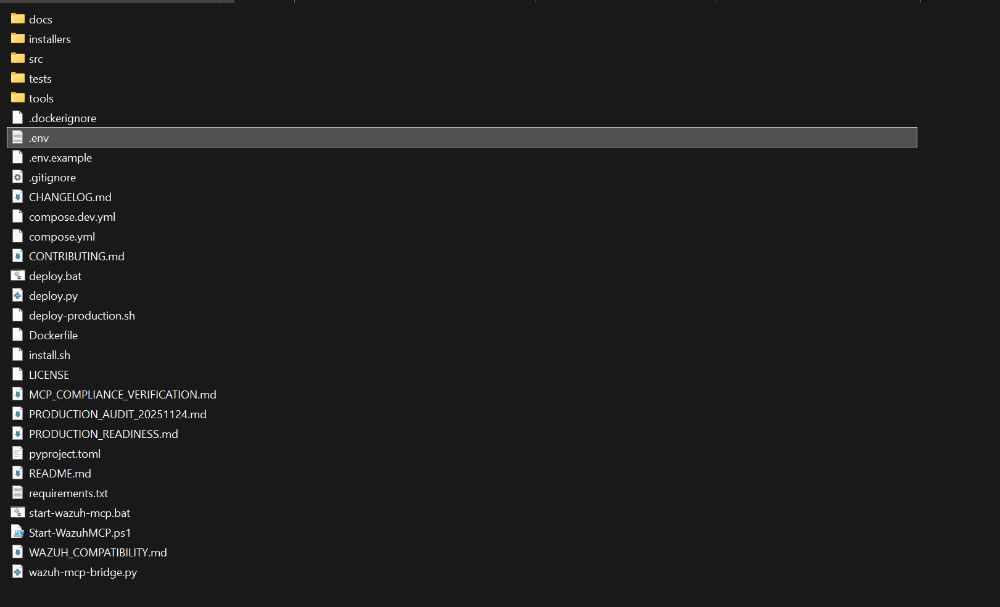
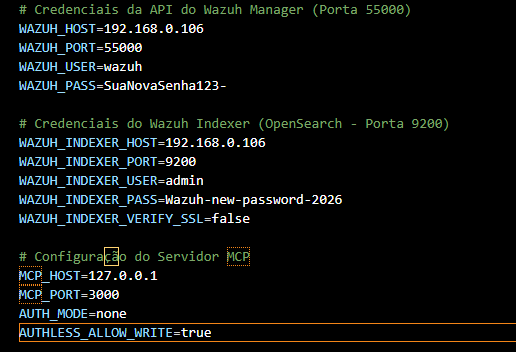
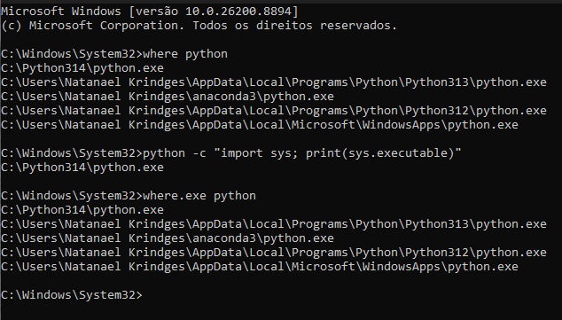
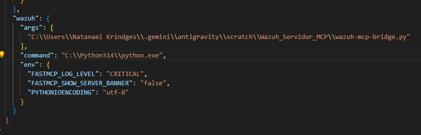
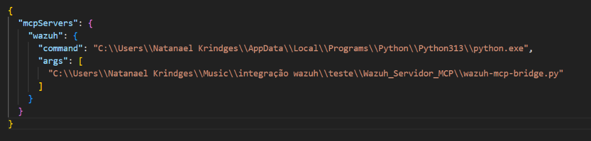
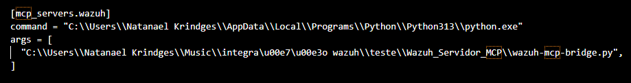

# 🛡️ Wazuh Servidor MCP (Model Context Protocol)

[](LICENSE)
[](https://www.python.org/)
[](https://modelcontextprotocol.io/)

**Converse com o seu SIEM Wazuh em Português.** Consulte alertas, investigue ameaças com SOAR/DFIR, verifique vulnerabilidades (CVEs), gerencie regras, decodificadores e execute ações de resposta ativa no seu ambiente Wazuh através de conversação natural com assistentes de IA (Antigravity IDE, LM Studio, Claude Desktop, VS Code).

---

## 🚀 Recursos e Funcionalidades

- **78 Ferramentas de Segurança 100% em Português**: Ferramentas em `snake_case` prontas para uso por qualquer assistente MCP.
- **Orquestrador de Triagem SOAR (`investigar_incidente_wazuh`)**: Investigação automática em 11 etapas (Alertas, Agente, Processos, Portas, Vulnerabilidades, IOCs, MITRE, FIM, Timeline, Risco e Contenção).
- **Conformidade & Audit Regulatório**: Relatórios automatizados para **LGPD (Art. 46)**, **NIST SP 800-53** e **CIS Benchmark**.
- **Gestão de Regras e Decodificadores**: Criação, modificação, testes (`wazuh-logtest`) e exclusão de regras e decodificadores XML customizados.
- **Resposta Ativa e Contenção**: Bloqueio de IPs em firewall, isolamento de hosts comprometidos, encerramento de processos e quarentena de arquivos com rollback.
- **Suporte Duplo (HTTP SSE e Stdio Proxy)**: Inclui o `wazuh-mcp-bridge.py` para integração direta em clientes stdio com zero fricção.

---

## 📊 Matriz das 78 Ferramentas de Segurança em Português

| Categoria | Ferramentas | Descrição |
|-----------|-------------|-----------|
| **Orquestração SOAR / DFIR** | `investigar_incidente_wazuh` | Investigação completa em 11 etapas com cálculo de risco (0-100) e plano de contenção |
| **Alertas e Eventos** | `obter_alertas_wazuh` `obter_resumo_alertas_wazuh` `analisar_padroes_alertas` `buscar_eventos_seguranca` `obter_dashboard_alertas` | Consulta, filtragem, busca livre e dashboards executivos de alertas |
| **Agentes e Infraestrutura** | `obter_agentes_wazuh` `obter_agentes_ativos_wazuh` `verificar_saude_agente` `obter_processos_agente` `obter_portas_agente` `obter_configuracao_agente` `obter_pacotes_agente` `gerenciar_grupos_agente` | Monitoramento completo de agentes, processos, portas e gestão de grupos |
| **Integridade de Arquivos (FIM)** | `obter_alteracoes_fim_agente` `obter_estatisticas_fim` `buscar_eventos_fim` `obter_arquivo_monitorado` | Monitoramento e auditoria de alterações em arquivos e registros |
| **Vulnerabilidades (CVEs)** | `obter_vulnerabilidades_wazuh` `obter_vulnerabilidades_criticas_wazuh` `obter_resumo_vulnerabilidades_wazuh` `buscar_vulnerabilidades_cve` `buscar_vulnerabilidades_pacote` `buscar_vulnerabilidades_severidade` `obter_dashboard_vulnerabilidades` | Análise profunda de vulnerabilidades, pacotes e CVEs |
| **Regras XML Customizadas** | `obter_resumo_regras_wazuh` `obter_detalhes_regra_wazuh` `testar_mensagem_log_wazuh` `criar_regra_customizada_wazuh` `modificar_regra_customizada_wazuh` `excluir_regra_customizada_wazuh` | Teste em simulador (`wazuh-logtest`), criação, edição e exclusão de regras XML |
| **Decodificadores XML** | `obter_resumo_decodificadores_wazuh` `criar_decodificador_customizado_wazuh` `modificar_decodificador_customizado_wazuh` `excluir_decodificador_customizado_wazuh` | Gestão completa de decodificadores XML customizados (`/etc/decoders/`) |
| **Conformidade & SCA** | `obter_resultados_conformidade` `obter_politicas_conformidade` `obter_falhas_conformidade` `executar_teste_conformidade` | Testes de configuração e aderência a políticas de segurança (SCA) |
| **Inteligência MITRE ATT&CK** | `obter_tecnicas_mitre` `buscar_alertas_por_mitre` `estatisticas_mitre` | Mapeamento de táticas, técnicas e estatísticas do MITRE |
| **Análise e Relatórios Regulatórios** | `analisar_ameaca_seguranca` `verificar_reputacao_ioc` `executar_avaliacao_risco` `obter_principais_ameacas_seguranca` `gerar_relatorio_seguranca` `gerar_relatorio_nist` `gerar_relatorio_cis` `gerar_relatorio_lgpd` | Relatórios de auditoria para **LGPD**, **NIST SP 800-53**, **CIS Benchmark** e relatórios de segurança |
| **Resposta Ativa e Contenção** | `resposta_ativa_wazuh` `bloquear_ip_wazuh` `isolar_host_wazuh` `encerrar_processo_wazuh` `desabilitar_usuario_wazuh` `quarentena_arquivo_wazuh` `bloquear_firewall_wazuh` `negar_host_wazuh` `reiniciar_servico_wazuh` | Ações defensivas executadas no ambiente |
| **Verificação e Desfazer (Rollback)** | `verificar_ip_bloqueado_wazuh` `verificar_isolamento_agente_wazuh` `verificar_processo_wazuh` `verificar_status_usuario_wazuh` `verificar_quarentena_arquivo_wazuh` `desisolar_host_wazuh` `habilitar_usuario_wazuh` `restaurar_arquivo_wazuh` `permitir_firewall_wazuh` `permitir_host_wazuh` | Verificação e reversão de contenções |

---

## 🛠️ Guia de Início Rápido

### Pré-requisitos
- **Python 3.11+**
- **Wazuh Manager (v4.8.0+)** com credenciais da API habilitadas (porta `55000`)
- **Wazuh Indexer (OpenSearch)** na porta `9200` (necessário no Wazuh 4.8+ para busca de alertas e vulnerabilidades)

### ⚙️ Configuração Recomendada no Servidor Wazuh (Linux)

Para garantir que o servidor MCP consiga se conectar ao Wazuh a partir da sua rede local (ou máquina de desenvolvimento):

1. **Liberar as Portas no Firewall do Linux**:
   - **UFW (Ubuntu / Debian)**:
     ```bash
     sudo ufw allow 55000/tcp comment 'Wazuh Manager API'
     sudo ufw allow 9200/tcp comment 'Wazuh Indexer OpenSearch'
     sudo ufw reload
     ```
   - **Firewalld (RHEL / AlmaLinux / Rocky)**:
     ```bash
     sudo firewall-cmd --add-port=55000/tcp --permanent
     sudo firewall-cmd --add-port=9200/tcp --permanent
     sudo firewall-cmd --reload
     ```

2. **Permitir Conexões Externas no Wazuh Indexer (`/etc/wazuh-indexer/opensearch.yml`)**:
   Por padrão, o OpenSearch pode vir escutando apenas em `127.0.0.1`. Para permitir que o MCP Server consulte o Indexer na porta 9200:
   - Abra o arquivo de configuração do Indexer:
     ```bash
     sudo nano /etc/wazuh-indexer/opensearch.yml
     ```
   - Verifique ou altere a diretiva `network.host` para aceitar conexões da rede:
     ```yaml
     network.host: 0.0.0.0
     ```

   

   - Reinicie o serviço do Wazuh Indexer para aplicar as alterações:
     ```bash
     sudo systemctl restart wazuh-indexer
     ```
  ---
### Instalação e Configuração

1. **Clonar o repositório**:
   ```bash
   git clone https://github.com/nks1097/Wazuh_Servidor_MCP.git
   cd Wazuh_Servidor_MCP
   ```

2. **Configurar as variáveis no arquivo `.env`**:
   ```env
   # Credenciais da API do Wazuh Manager (Porta 55000)
   WAZUH_HOST=seu-IP-wazuh-manager-local
   WAZUH_PORT=55000
   WAZUH_USER=wazuh
   WAZUH_PASS=SuaSenhaWazuh

   # Credenciais do Wazuh Indexer (OpenSearch - Porta 9200)
   WAZUH_INDEXER_HOST=seu-IP-wazuh-indexer-local
   WAZUH_INDEXER_PORT=9200
   WAZUH_INDEXER_USER=admin
   WAZUH_INDEXER_PASS=SuaSenhaIndexer
   WAZUH_INDEXER_VERIFY_SSL=false

   # Configuração do Servidor MCP
   MCP_HOST=127.0.0.1
   MCP_PORT=3000
   AUTH_MODE=none
   AUTHLESS_ALLOW_WRITE=true
   ```
   * crie o arquivo .env
     
     


   * Exemplo das configuraçoes do arquivo .env
     
     

    ---
4. **Como integrar no Antigravity IDE, LM Studio e ChatGPT Codex**:

   > 💡 **1. Como encontrar o caminho exato do seu `python` (Windows / Linux / macOS)**:
   > No campo `"command"` da configuração abaixo, você deve informar o caminho absoluto do executável do Python. Para descobrir o caminho correto:
   > 
   > - **No Linux / macOS**:
   >   ```bash
   >   which python3
   >   # ou usando o próprio Python:
   >   python3 -c "import sys; print(sys.executable)"
   >   ```
   > - **No Windows (CMD / PowerShell)**:
   >   ```cmd
   >   where python
   >   ```
   >   No PowerShell:
   >   ```powershell
   >   (Get-Command python).Source
   >   ```
   >
   > 
   >
   > 📁 **2. Onde fica o arquivo `wazuh-mcp-bridge.py`?**:
   > O script de ponte `wazuh-mcp-bridge.py` fica localizado na **raiz da pasta do projeto clonado** (`Wazuh_Servidor_MCP/wazuh-mcp-bridge.py`).
   > Para obter o caminho absoluto exato para colocar no campo `"args"`:
   > - **No Linux / macOS**: Navegue até a pasta do projeto e rode `pwd`. O caminho final será: `/caminho/obtido/Wazuh_Servidor_MCP/wazuh-mcp-bridge.py`.
   > - **No Windows**: Abra o PowerShell na pasta do projeto e rode `(Get-Item wazuh-mcp-bridge.py).FullName`. Exemplo: `C:\Users\SeuUsuario\Wazuh_Servidor_MCP\wazuh-mcp-bridge.py`.

   #### 🔹 Para Antigravity IDE (`C:\Users\<SeuUsuario>\.gemini\config\mcp_config.json`):
   ```json
   {
     "mcpServers": {
       "wazuh": {
         "command": "C:\\Caminho\\Para\\Seu\\python.exe",
         "args": [
           "C:\\Caminho\\Para\\Wazuh_Servidor_MCP\\wazuh-mcp-bridge.py"
         ],
         "env": {
           "FASTMCP_LOG_LEVEL": "CRITICAL",
           "FASTMCP_SHOW_SERVER_BANNER": "false",
           "PYTHONIOENCODING": "utf-8"
         }
       }
     }
   }
   ```
   * imagem de Exemplo de configuração mcp_config.json para o Antigravity IDE

   

   #### 🔹 Para LM Studio:
   ```json
   {
     "mcpServers": {
       "wazuh": {
         "command": "C:\\Caminho\\Para\\Seu\\python.exe",
         "args": [
           "C:\\Caminho\\Para\\Wazuh_Servidor_MCP\\wazuh-mcp-bridge.py"
         ]
       }
     }
   }
   ```
    * imagem de Exemplo de configuração mcp_config.json para o LM Studio
   
   

   #### 🔹 Para ChatGPT Codex (`C:\Users\<SeuUsuario>\.codex\config.toml` ou `~/.codex/config.toml`):
   ```toml
   [mcp_servers.wazuh]
   command = "C:\\Caminho\\Para\\Seu\\python.exe"
   args = [
     "C:\\Caminho\\Para\\Wazuh_Servidor_MCP\\wazuh-mcp-bridge.py",
   ]
   ```
    * imagem de Exemplo de configuração mcp_config.json para o codex
   
   

---
### VIDEO DE CONFIGURAÇÃO DE FORMA SIMPLIFICADA USANDO GRATUITAMENTE LLM LOCAL COM LM STUDIO

 


## 📜 Licença

Distribuído sob a licença **MIT**. Veja o arquivo [LICENSE](LICENSE) para mais detalhes.
